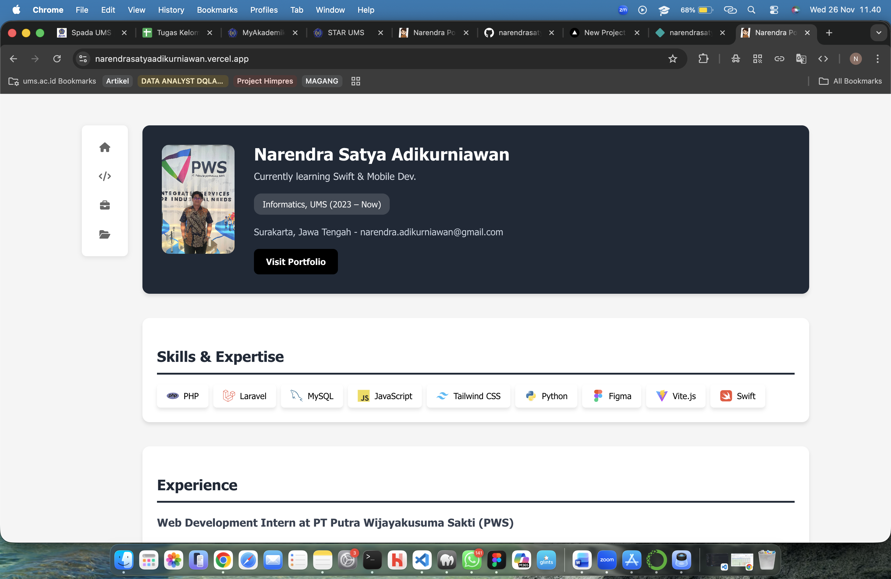

# Single Page Application (SPA) ReactJS: CV Mahasiswa

Repositori ini merupakan penyelesaian #**Tugas 1 – Pemrograman Web Berbasis Framework** dengan membuat aplikasi **Single Page Application (SPA)** menggunakan **ReactJS** untuk menampilkan CV Mahasiswa.

## 📌 Informasi Tugas

* **Mata Kuliah**: Pemrograman Web Berbasis Framework
* **Jenis Tugas**: Individu
* **Deadline**: Jumat, 28 November 2025 – 23:59 WIB
* **Deployment**: Vercel
* **Pengumpulan**: GitHub Classroom


## 🧩 Deskripsi Aplikasi

Aplikasi ini adalah **SPA ReactJS** yang menampilkan informasi CV mahasiswa, terdiri dari lima bagian utama:

1. **Profile** – Menampilkan foto, nama, NIM, dan biodata singkat
2. **Skills** – Menampilkan daftar kemampuan technical skills dengan level keahlian
3. **Experience** – Menampilkan pengalaman organisasi, magang, dan pekerjaan
4. **Projects** – Menampilkan portfolio project yang telah dikerjakan
5. **Sidebar** – Navigasi menu untuk berpindah antar section

Data mahasiswa disimpan dalam file terpisah (`dataNarendra.json`) dan di-load secara otomatis tanpa hardcode di komponen.

---

## 📂 Struktur Folder

```
cv-narendra/
├── public/
├── src/
│   ├── components/
│   │   ├── Profile.jsx
│   │   ├── Skills.jsx
│   │   ├── Experience.jsx
│   │   ├── Project.jsx
│   │   └── Sidebar.jsx
│   ├── assets/
│   │   └── components/
│   │       └── Profile.jsx
│   ├── dataNarendra.json
│   ├── App.jsx
│   ├── App.css
│   ├── index.css
│   └── main.jsx
├── index.html
├── package.json
├── vite.config.js
├── eslint.config.js
└── README.md
```

---

## ⚙️ Teknologi yang Digunakan

* ReactJS (Vite)
* JSX
* CSS / Tailwind / Bootstrap (opsional)
* Deployment: Vercel 

--- 

## 🚀 Cara Menjalankan Proyek
### 1. Clone Repository

```bash
git clone https://github.com/tif1336/single-page-application-reactjs-untuk-cv-mahasiswa-narendrasatyaa.git
cd single-page-application-reactjs-untuk-cv-mahasiswa-narendrasatyaa/cv-narendra
```

### 2. Install Dependencies

```bash
npm install
```

### 3. Jalankan Server Development

```bash
npm run dev
```

### 4. Akses Aplikasi

Buka di browser:

```
http://localhost:5173/
```

---

## 🌐 Deployment

Aplikasi telah di-deploy menggunakan:

**URL Deployment**: https://narendrasatyaadikurniawan.vercel.app/

Platform:

* Vercel
---

## 📸 Screenshot Hasil

Tambahkan screenshot tampilan aplikasi di sini:



---

## 📝 Ketentuan Tugas (Ringkasan)

* ✅ Membuat SPA React minimal 3 komponen: Profile, Skills, Experience
* ✅ Menambah komponen tambahan: Projects, Sidebar
* ✅ Data CV diganti dengan data pribadi (Narendra Satya Adikurniawan)
* ✅ Data disimpan pada file `dataNarendra.json` terpisah
* 🚀 Deployment wajib dan link harus dicantumkan
* ✅ Commit harus bertahap dan rapi

---

## 👤 Pembuat

**Nama**: Narendra Satya Adikurniawan  
**NIM**: L200230209  
**Program Studi**: Informatika UMS 
**Portfolio**: https://narendrasatyaa.github.io  
**Link Baru** : https://narendrasatyaadikurniawan.vercel.app/